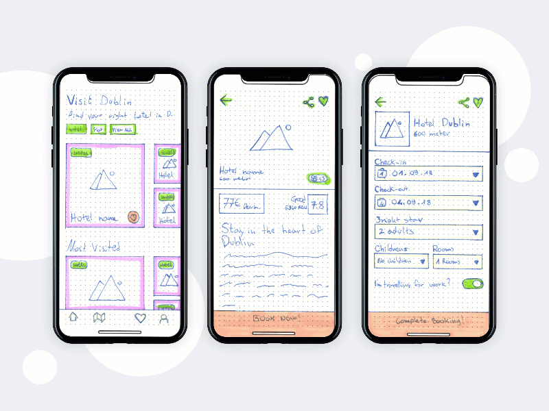

# Android Developer Challenge (#AndroidDevChallenge) - Submission Two
 
## Tell us what your idea is.
 
An app to convert wireframes (handwritten or otherwise) to material designs, so the users can preview/fine-tune them on a real device and finally export them to an image or even flutter code that can be run on Android, iOS and browser.
 
For instance this is a wireframe gif by [Marko Peric](https://dribbble.com/shots/5036975-Visit-Dublin-iOS-Application), which shows the whole process in action – from those initial rough content sketches, right through to the fully-designed app, complete with photos, fonts, and colors. (from [Cacoo blog](https://dribbble.com/shots/5036975-Visit-Dublin-iOS-Application))

 
### How the app will work?
 
1. User imports a wireframe. It can be:
   - an image from phone gallery.
   - a picture taken from phone camera.
   - an image shared from a drawing app like OneNote. It is especially good on tablets that support pen input.
2. The app will use the TensorFlow lite and a model to detect and list the Google material design's components on the input.
3. User can check the detected material components and edit them.
   - User can add the missing components to the list. This input will help us to re-train the model.
   - User can remove components from the list.
   - User can tap on one item to customize it. They can:
       - Change the component type/class if the app detected it wrong. This input also will also help us to re-train the model.
       - Select material colors and theme for the components.
       - Set specific properties of components. For instance:
           - Button type. It can be Text button, Outlined Button, Contained button.
           - Choose an image for image components.
 
           - Add text to text components. In future we can detect the text from the input automatically.
4. User then can preview the design on the device as a full screen picture. User should be able to go back and forth quickly between the component list and the full screen design preview.
5. Finally, the user can export the list to flutter widgets in a single file per design.
 
To me it is interesting to go on the stage at Google I/O, draw a wireframe on a piece of paper or a tablet, convert it to material design, fine-tune the design by adding images and colors, convert it to flutter code, export the dart file and add it to an existing Flutter project with the backend Firebase code, and finally build the iOS/Android apps on real devices. All in 5 to 10 minutes.
 
## Tell us how you plan on bringing it to life.
 
### The Timeline
 
Because we have a time limit of 4.5 months, I believe we can break down the project into two milestones. The first one is to get an image, and to detect a small number of components (image, text, button, card), and to display the full-screen preview of the final design. Then depending on the results of the first milestone and the remaining time, for the second milestone, we can either add all other material components, or add the code to export the output to flutter code, or add user login so they can sync their data between devices, or something in between. Regardless of that, the following is my time estimations (product roadmap) of this app.

#### December 2019 :
- UI/UX Design: The app will roughly have 4 screens. I will try to use [Google Materiel Design](https://material.io/design/) as well as [ML Kit Showcase App with Material Design](https://github.com/firebase/mlkit-material-android) and [Patterns for machine learning-powered features](https://material.io/collections/machine-learning/).

#### January 2020 :
- AI: This will be the biggest part of the app. I will use TensorFlow based solutions from Google. I can break down this step into two major parts:
 
   - Dataset Preparation: This should be the most challenging part of the whole project. I either have to find an existing dataset like [The Oxford-IIIT Pet Dataset](http://www.robots.ox.ac.uk/~vgg/data/pets/) and [Quick Draw website](https://quickdraw.withgoogle.com/data) or create my own dataset. If I want to create the dataset, I will start with 4 classes and almost 800 labeled images. This will take almost 3 weeks if I manage to label 40 images per day.
 
  - Train, Test, and Deploy: If possible I will use the available firebase [ML Kit's on-device object detection and tracking API](https://firebase.google.com/docs/ml-kit/object-detection). If not, use [the Google Cloud Platform's user interface (UI)](https://cloud.google.com/vision/automl/object-detection/docs/edge-quickstart) to interact with the Cloud AutoML API to train a custom model and export it as a AutoML Vision Edge model. Then I can use Firebase [AutoML Vision Edge](https://firebase.google.com/docs/ml-kit/train-image-labeler) to host this model, and load them at run time with the iOS and Android SDKs. I will also bundle the model with the apps, so it will be immediately available on install. For this step I will consider 3 days, but this step can be combined with other steps too.

#### February 2020 :

- Bootcamp at Google: By this time I have the design, a mockup, and the model. 

#### March & April 2020 :

- Mobile Apps: I will use flutter for this project to make iOS and Android Apps. This will take 4 weeks.

- Backend: I described most of the backend developments at the AI step. I will also use Firebase for Google Analytics (1 day), to send user’s edits to retrain the model (1 week), and finally for users to login and move their projects between devices (1 week). In total this will take almost 2 weeks.

- As you can see these steps will roughly take 10.5 weeks. As I mentioned before, depending on the results, I will use the remaining time to further improve the app.

#### May 2020 : 

- Release: Mostly to prepare the store listing, including the app icons, the screenshots, the descriptions and the rest.

### Google’s help
 
The Google can help me with dataset preparation, training, and everything related to them. For instance how can I use the technique known as [transfer learning](https://www.tensorflow.org/lite/models/object_detection/overview) with [the Cloud Platform UI](https://cloud.google.com/vision/automl/object-detection/docs/edge-quickstart) to use a [starter model](https://www.tensorflow.org/lite/models/object_detection/overview#starter_model). Besides, I only have a MacBook pro, and I do not have access to a system with a good GPU for training. It would be great if I could be able to use Google AI Platform on GCP and Firebase to implement this project. Finally, Google can help me reach out to much more people, and that means better data, which ultimately translate to a better app.
 
## Tell us about you.
 
I have a bachelor’s degree in computer engineering and my master’s studies was on Informatics engineering. My thesis project was about biologically inspired computer vision, so I have a different (good) understanding on deep learning that was inspired by perception in the human visual system.
 
I started working at the software development companies, writing FoxPro and Visual Basic code, when I was a sophomore in high school. Professionally, I have more than 10 years of experience in software development. I have more than 5 years experience in mobile development working on 7 Android and 3 iOS apps.
 
Currently I am the Mobile Team Lead at an international company in Europe. We are a team of 19 developers across all areas, 4 of whom are mobile developers. I am managing the mobile team and responsible for 4 projects which includes 7 applications. I am still enjoying writing mobile and backend codes every chance I get in the following areas: DevOps (Microsoft TFS, Git, Jenkins Automated UI Testing), Mobile Development (Flutter, IOS(SWIFT), Android(Kotlin, Java)), JavaScript (Node.js), Databases(SQL, NoSQL), Cloud Computing (Azure, Firebase, AWS), AI (TensorFlow, Image Processing (OpenCV)).
